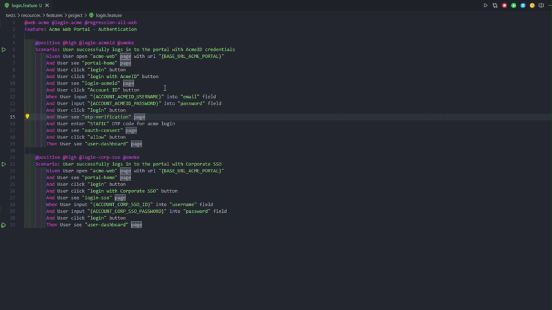
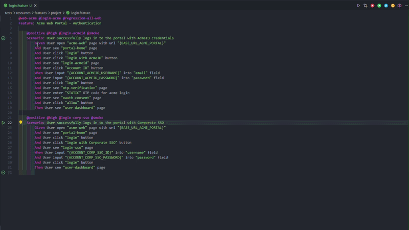

# 🥒 Playwright BDD Runner

**Run Playwright BDD scenarios directly from `.feature` files in VS Code.**

*Playwright BDD Runner helps QA and automation engineers run tests faster, troubleshoot easier, and stay focused without leaving their Gherkin files.*

---

## 👀 See it in Action

*See how easy it is to run and debug your scenarios.*

### 1) Run Scenario

**Quick Preview:**   

### 2) Run with Headless or Headed Mode

**Quick Preview:**   

*(Tip: Keep each GIF under 15 seconds so users can quickly understand the flow.)*

---

## ✨ Key Features

- **🎯 Precision Run:** Execute the exact scenario at your cursor, or run the entire `.feature` file.
- **⚡ Run at Cursor:** Run a scenario or example row instantly using your default run mode.
- **🔄 Re-run Failed:** Instantly retry failed tests from the last execution.
- **🧪 Native Integration:** Fully supports VS Code's Testing Panel (including Scenario Outlines).
- **🖥️ Mode Toggle:** Choose between Headless or Headed mode on the fly.
- **📊 Run Summary:** See passed/failed counts and duration in the status bar after test runs.
- **📦 Package Manager Aware:** Auto-detects `npm`, `yarn`, `pnpm`, or `bun` from your project's `packageManager` field or lockfile.
- **🗂️ Monorepo Friendly:** Runs commands from the nearest `package.json` to the feature file, not the workspace root.

## 🚀 Quick Start

1. Open any `.feature` file in your Playwright + BDD project.
2. Place your cursor inside a `Scenario`.
3. Open Command Palette (`Ctrl+Shift+P` / `Cmd+Shift+P`) and run: **`Playwright BDD Runner: Run Scenario`**.

## ⌨️ Commands

| Command | Description |
| :--- | :--- |
| `Playwright BDD Runner: Run Scenario` | Run scenario at cursor |
| `Playwright BDD Runner: Run at Cursor` | Run scenario or example row at cursor using default run mode |
| `Playwright BDD Runner: Run Feature` | Run all scenarios in active file |
| `Playwright BDD Runner: Re-run Failed` | Execute only failed tests |
| `Playwright BDD Runner: Stop` | Terminate active process |

## ⚙️ Settings

Customize in `settings.json`:

| Setting | Default | Description |
| :--- | :--- | :--- |
| `bddScenarioRunner.packageManager` | `auto` | Package manager (`auto`/`npm`/`yarn`/`pnpm`/`bun`). Auto-detects from `packageManager` field or lockfiles |
| `bddScenarioRunner.askRunMode` | `true` | Show headless/headed prompt per run |
| `bddScenarioRunner.defaultRunMode` | `headless` | Fallback if prompt is disabled |
| `bddScenarioRunner.autoClearTerminal` | `true` | Clear terminal before execution |
| `bddScenarioRunner.terminalRunBehavior` | `transient` | Terminal behavior (`transient` = auto-close per run, `persistent` = reuse terminal) |
| `bddScenarioRunner.forceShell` | `auto` | Override default shell (e.g., `pwsh`) |

The default command templates use a `{pm}` placeholder that resolves to the detected runner (`npx`/`yarn`/`pnpm`/`bunx`). You can override the templates directly if your workflow needs a custom invocation.

---

**[📚 View Full User Guide & Troubleshooting](docs/USER-GUIDE.md)** • **[📝 Changelog](CHANGELOG.md)**

*Requires VS Code 1.90+ and an existing Playwright+BDD project.*

