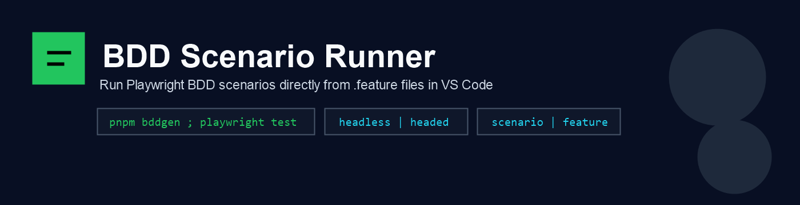
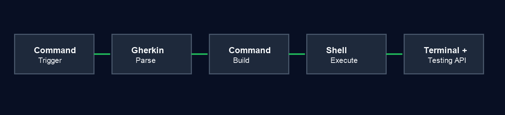

# BDD Scenario Runner

Run Playwright BDD scenarios directly from .feature files in VS Code.

BDD Scenario Runner helps QA and automation engineers run tests faster without leaving Gherkin files.

## What You Get

- Run scenario at cursor.
- Run all scenarios in current feature.
- Re-run only failed tests.
- Run from Testing panel, including Scenario Outline example rows.
- Choose headless or headed mode.

## Quick Start (1 Minute)

1. Open a project that already has Playwright + BDD setup.
2. Open any .feature file.
3. Place cursor inside a Scenario.
4. Run command: BDD Runner: Run Current Scenario.
5. Check output in terminal: BDD Scenario Runner.

## Commands

| Command | Purpose |
| --- | --- |
| BDD Runner: Run Current Scenario | Run scenario at current cursor |
| BDD Runner: Run Current Feature | Run all scenarios in the active feature file |
| BDD Runner: Re-run Failed | Run failed tests from previous run |
| BDD Runner: Diagnose Environment | Check shell and runtime readiness |

## Recommended Settings

| Setting | Default | Notes |
| --- | --- | --- |
| bddScenarioRunner.askRunMode | true | Show headless or headed picker each run |
| bddScenarioRunner.defaultRunMode | headless | Used when askRunMode is false |
| bddScenarioRunner.showTerminalOnRun | false | Reveal terminal automatically on run |
| bddScenarioRunner.autoClearTerminal | true | Clear terminal before new execution |
| bddScenarioRunner.forceShell | auto | Override shell only when needed |

## Requirements

- Existing Playwright + BDD workflow in your project.
- Node dependencies already installed.
- Typical commands available in project context (for example bddgen, playwright, pnpm).

## Compatibility

- VS Code 1.90+
- Windows, Linux, macOS
- PowerShell, pwsh, CMD, Bash, POSIX sh

## Troubleshooting

1. Nothing runs:
Active file must be .feature.

2. Shell mismatch on Windows:
Set bddScenarioRunner.forceShell to pwsh or powershell.

3. pnpm, playwright, or bddgen not found:
Install dependencies, then run BDD Runner: Diagnose Environment.

## Visual Flow

## Full User Guide

Need detailed walkthrough, examples, and cross-platform checklist?

- See docs/USER-GUIDE.md

## For Maintainers

- Run tests: npm test
- Create package: npm run package

